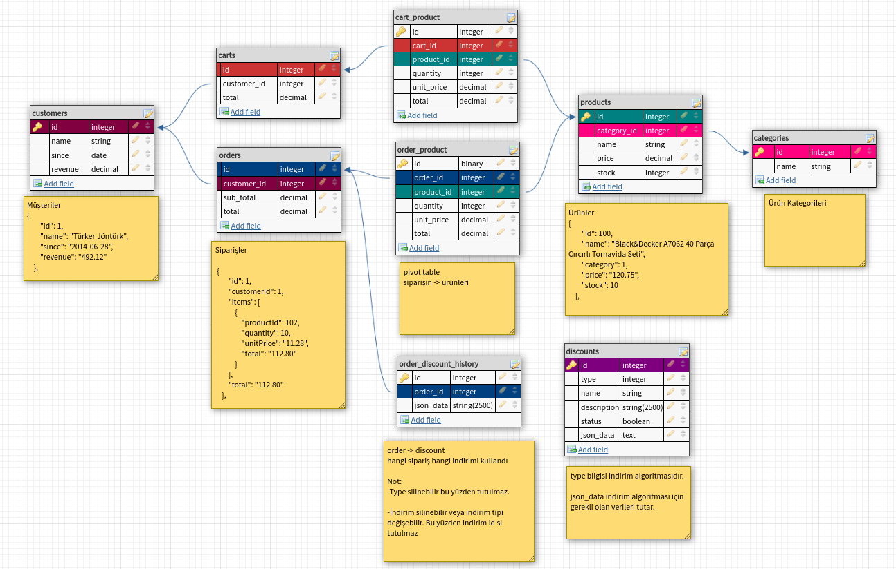

## Installation

### Docker Compose Install & Run
```
docker compose up -d
```

### Database Create
Veritabanı otomatik oluşmaz ise manuel oluşturabilirsiniz:
```
CREATE DATABASE ecommerce
```

### Migration
```
php bin/console doctrine:migrations:migrate
```

### Seed ( Dummy Data )
```
php bin/console doctrine:fixtures:load
```

### Migrate Fresh & Seed
Veritabanını dummy data ile birlikte tekrar oluşturmak için
```
php bin/console doctrine:migrations:migrate --seed
```

## About
Postman API ve Example Request için:\
https://documenter.getpostman.com/view/22844490/VUqmvJvC

### File Structure
```
|-- config
|    `-- bundles.php
|   |-- routes
|   |   `-- annotations.yaml
|-- migrations
|    `-- Version20220822074031.php
|-- src
|   |-- Command
|   |   `-- FreshCommand.php
|   |-- Controller
|   |   `-- OrderController.php
|   |-- DataFixtures
|   |   `-- AppFixtures.php
|   |   `-- CategoryFixtures.php
|   |   `-- ...
|   |-- Entity
|   |   `-- Category.php
|   |   `-- Order.php
|   |   `-- ...
|   |-- EventSubscriber
|   |   `-- ExceptionSubscriber.php
|   |-- Helper
|   |   `-- CalculationHelper.php
|   |   `-- GeneralHelper.php
|   |   `-- ...
|   |-- Repository
|   |   `-- BaseRepository.php
|   |   `-- OrderRepository.php
|   |   `-- ...
|   |-- Service
|   |   `-- BaseService.php
|   |   `-- OrderService.php
|   |   `-- ...
|   |-- docker
|   |   |-- images
|   |   |   |-- nginx
|   |   |   |-- php
|   |   |   |-- postgresql
|`-- .env
|`-- docker-compose.yml
```

### Preview
#### Database


#### Postman API
